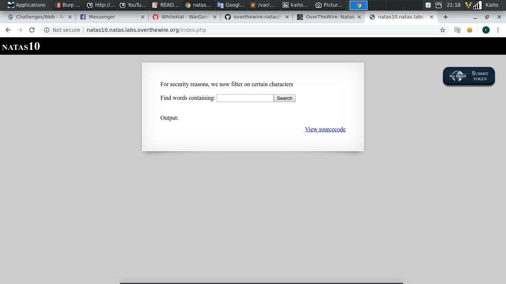
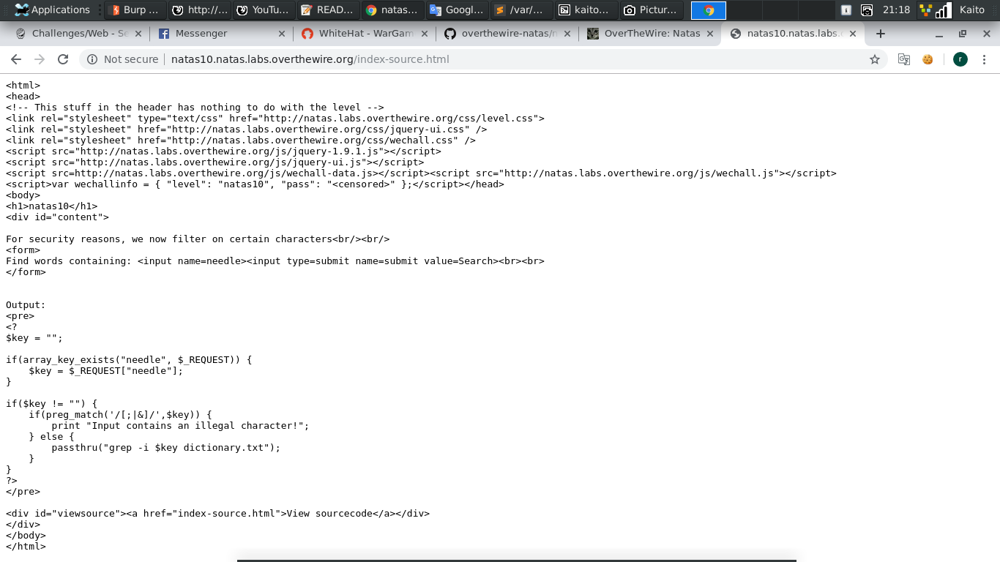
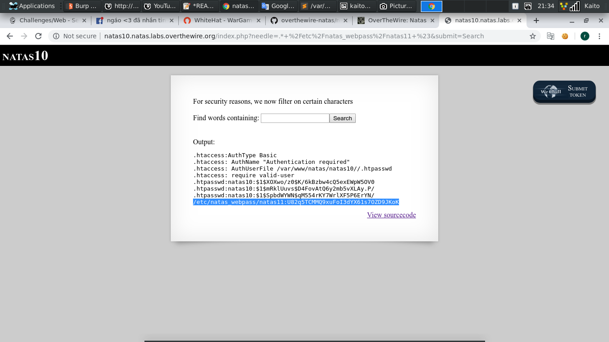

# Natas10

- Thử `viewsource` xem có gì

- Thực sự thì đây là bài `command injection` giống như bài `natas9`, chỉ là người ra đề chặn đi các k tự thường để bypass đi rồi

- Nhưng chỉ chặn chừng đó chưa đủ, trong grep còn nhiều thủ thuật tìm kiếm khác. Chẳng hạn như thêm `.*` trước cụm từ cần tìm kiếm

- `.*` thể hiện cho *0* hoặc *vô số* ký tự

- Hệ thống sẽ giúp ta tìm tất cả các từ có đuôi `/etc/natas_webpass/natas11`, cũng tức là flag. Thêm đuôi `#` để đánh dấu tất cả ký tự phía sau nó chỉ là `comment`

- Payload: `.* /etc/natas_webpass/natas11 #`

