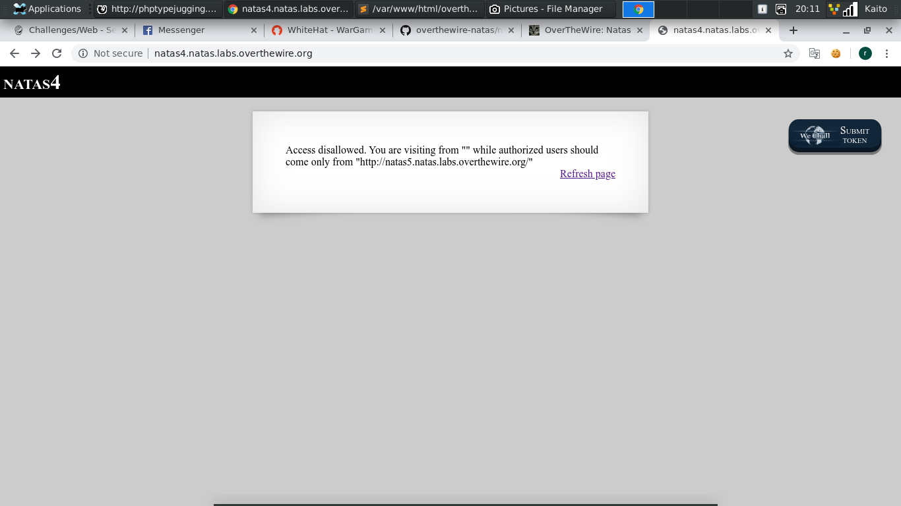
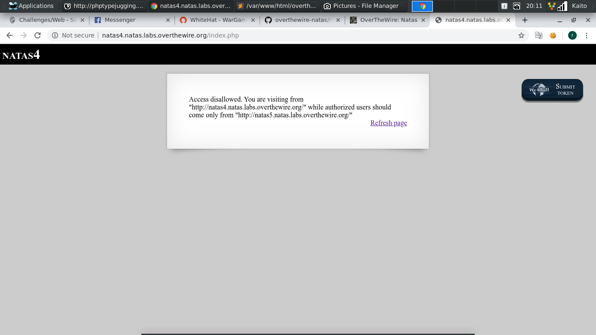
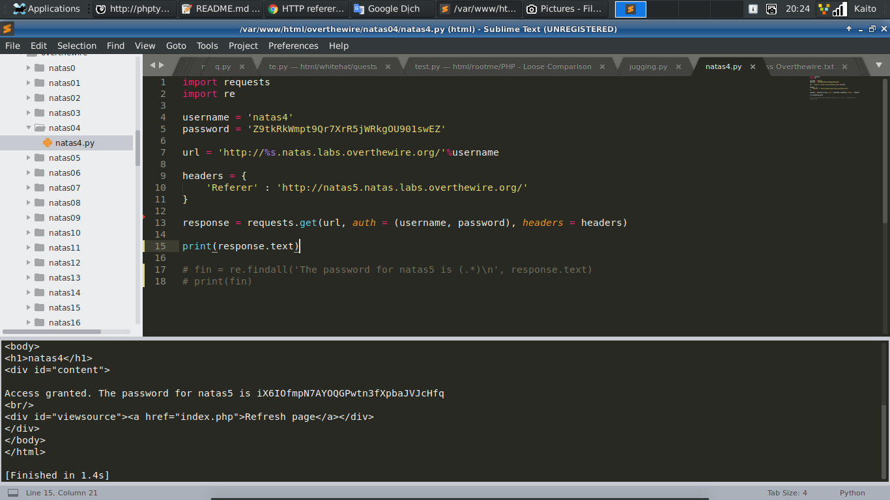

# Natas4



- Mở đầu file là 1 dòng thông báo

- Thử click vào `Refresh page` xem có gì đặc biệt không



- Thấy có vẻ link hiện tại được lấp vào vị trí còn trống `""`, thôi kệ nó, đọc kỹ thử

- Đọc dòng thông báo thì có vẻ đề yêu cầu ta phải đi từ `"http://natas5.natas.labs.overthewire.org/"` chứ không phải từ `"http://natas4.natas.labs.overthewire.org/"`

- Nghe hao hao giống `Referer` trong `Requests Headers`

- `Referer` lưu lại nơi mà bạn đã ở trước khi bạn chuyển hướng qua bên này

- Đọc thêm 1 chút về `Referer`: [Link](https://vi.wikipedia.org/wiki/HTTP_referer)

- Mạn phép giải bài này và các bài khác bằng `python` để tăng thêm phần hấp dẫn, sẽ hạn chế xài `burp suite`

- Code của mình:

```
	import requests
	import re

	username = 'natas4'
	password = 'Z9tkRkWmpt9Qr7XrR5jWRkgOU901swEZ'

	url = 'http://%s.natas.labs.overthewire.org/'%username

	headers = {
		'Referer' : 'http://natas5.natas.labs.overthewire.org/'
	}

	response = requests.get(url, auth = (username, password), headers = headers)

	print(response.text)
```

- Chỉ đơn giản là thêm `Referer` trong `headers` là xong


