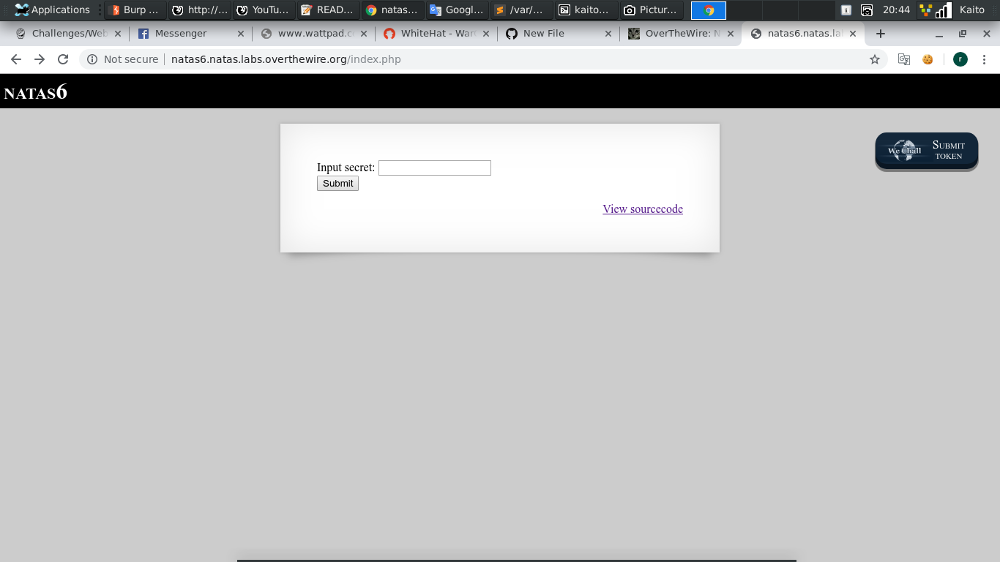
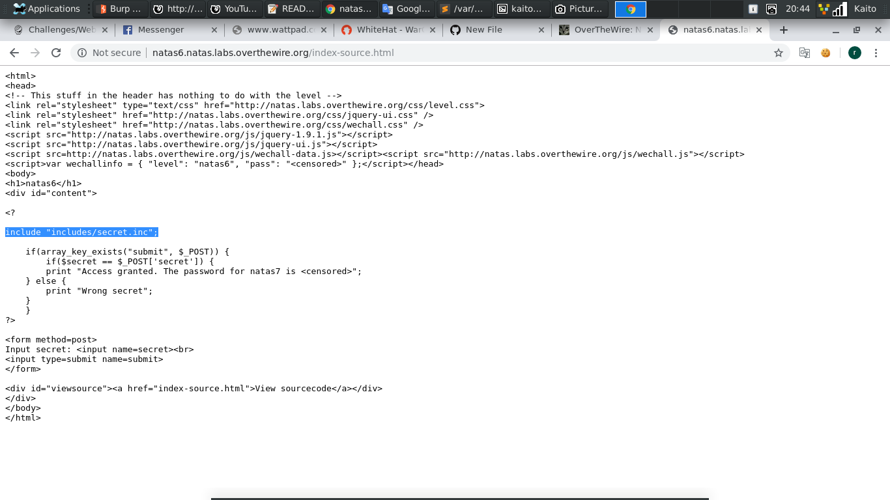
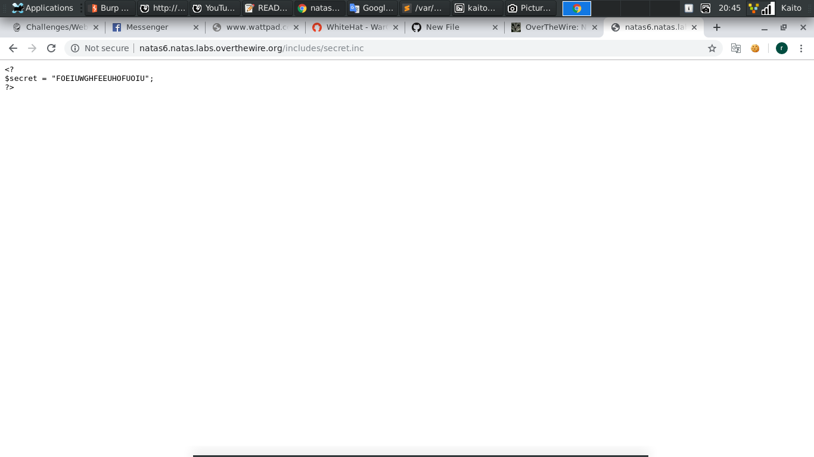
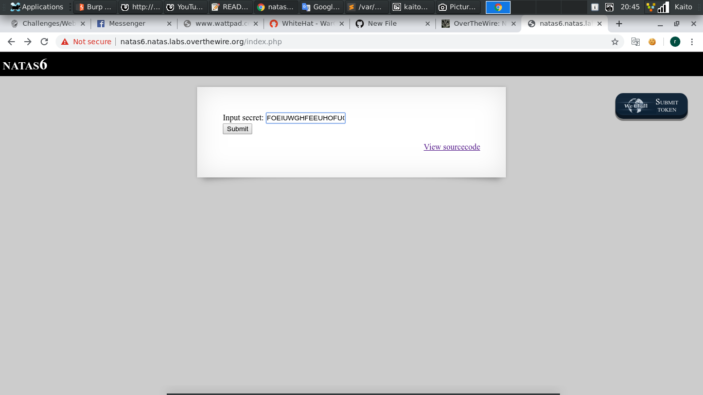
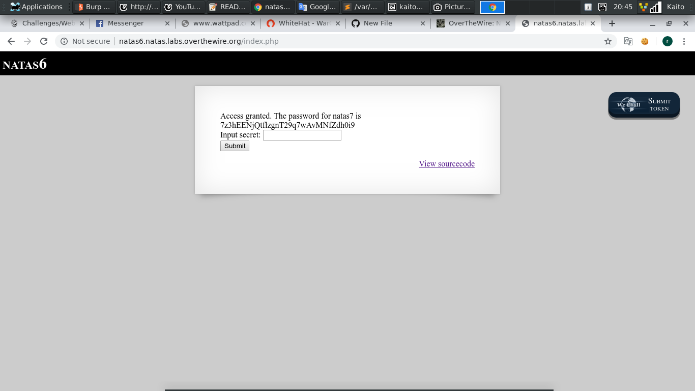

# Natas6

- Mới vô đề thì có 1 form input secret

- Đề bên `overthewire` khá dễ thở vì nhiều bài cho `source` luôn, thuận tiện cho việc học

- Để ý thì bài có `include` 1 file từ ngoài vào

- Thử truy cập file đó từ trên url xem được không

- Thật may là bài không hề khóa cũng không ẩn mà hiện luôn cho ta biến `secret`

- Input luôn biến vừa nãy

