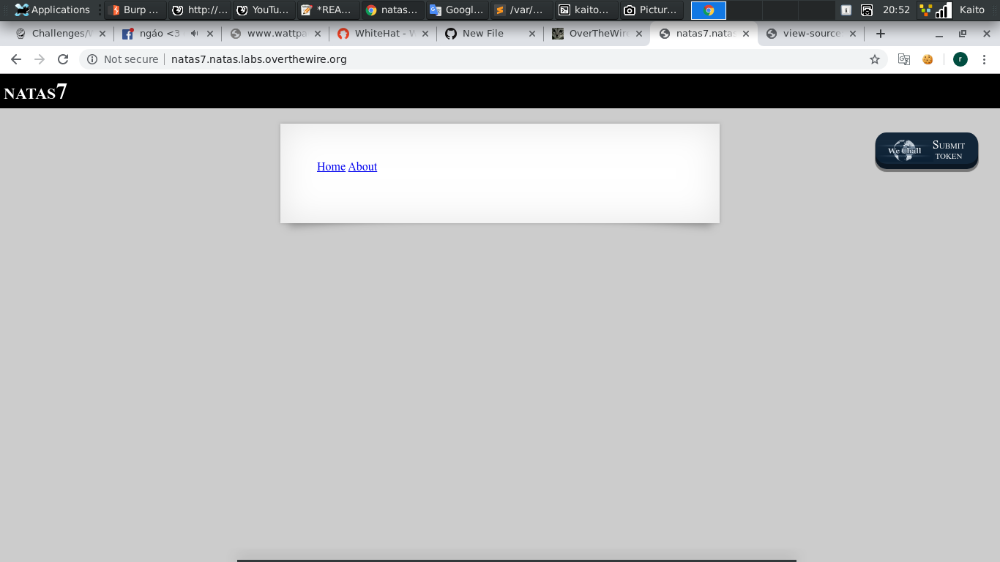
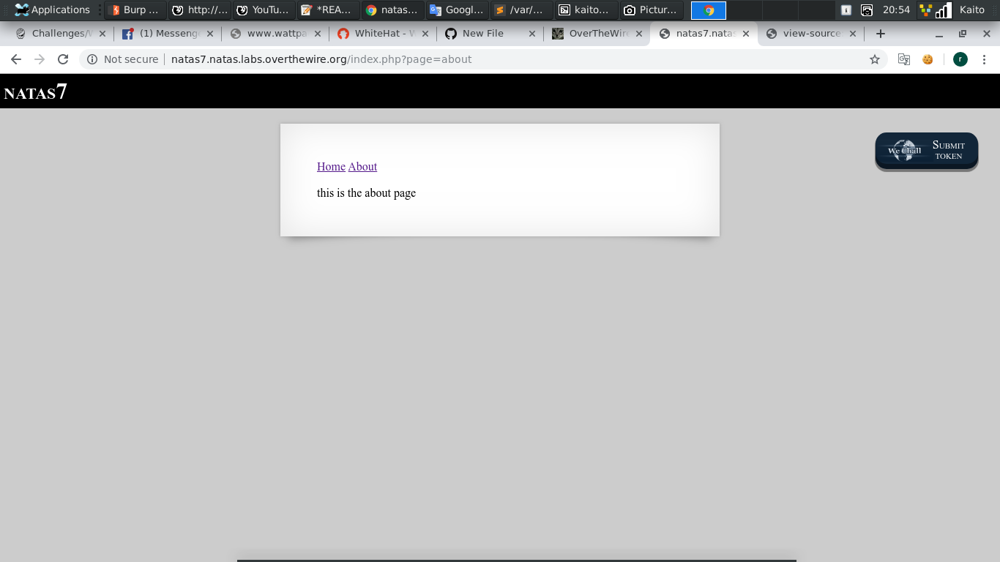
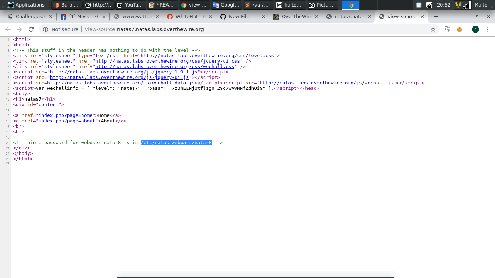
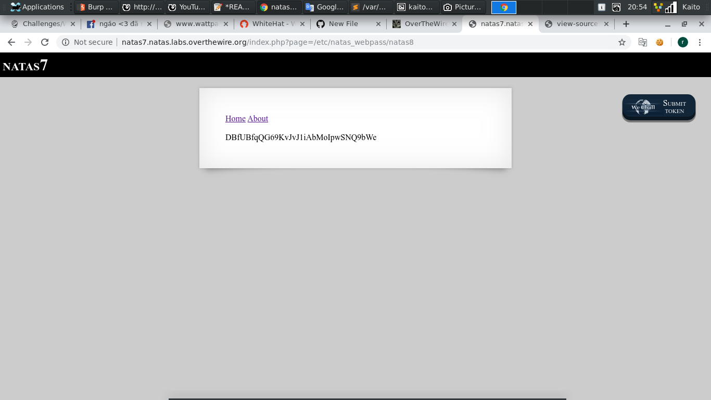

# Natas7

- Mở đầu trang web thì có vẻ có 2 page

- `Ctrl + U` xem thử thì thấy hint sau: `password for webuser natas8 is in /etc/natas_webpass/natas8`

- Hint cho đường dẫn, có nhiều page, nghe như có vẻ mùi LFI

- Hiểu thêm về lỗi LFI: [Link](https://securitydaily.net/tan-cong-file-inclusion/)

- Thử liền xem có được không, thay vì `?page=about` thì đổi thành `?page=/etc/natas_webpass/natas8`

- Khá bất ngờ là đề cho luôn chứ không cần thêm `../`
