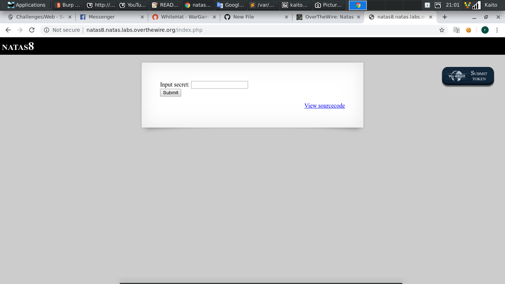
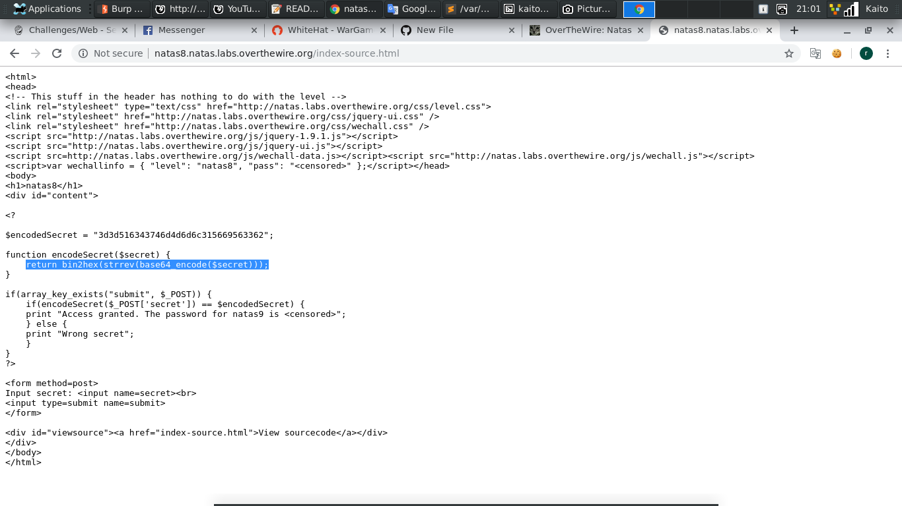
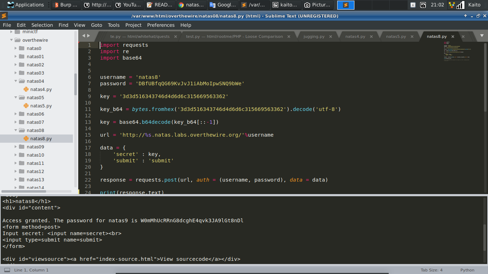

# Natas8



- Lại 1 bài input secret, thử `viewsource` xem có gì



- Nhìn có vẻ hổ báo nhưng thật ra chả có gì cả

- Bạn chỉ cần *decode* lại biến `$encodedSecret` theo chiều ngược lại là được

- Đây là code của mình:

```
	import requests
	import re
	import base64


	username = 'natas8'
	password = 'DBfUBfqQG69KvJvJ1iAbMoIpwSNQ9bWe'

	key = '3d3d516343746d4d6d6c315669563362'

	key_b64 = bytes.fromhex('3d3d516343746d4d6d6c315669563362').decode('utf-8')

	key = base64.b64decode(key_b64[::-1])

	url = 'http://%s.natas.labs.overthewire.org/'%username

	data = {
		'secret' : key,
		'submit' : 'submit'
	}

	response = requests.post(url, auth = (username, password), data = data)

	print(response.text)
```



