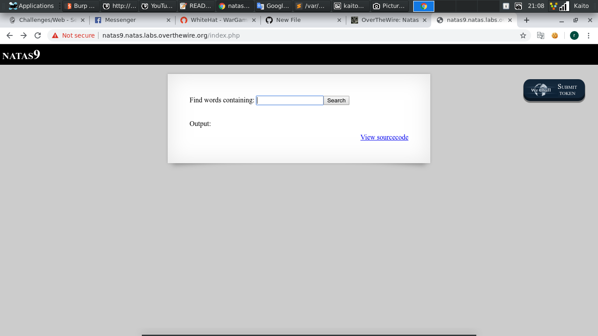
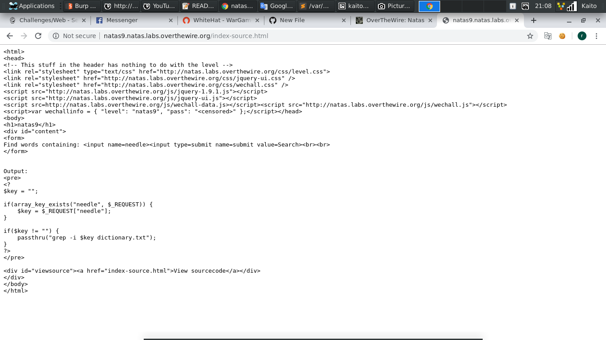
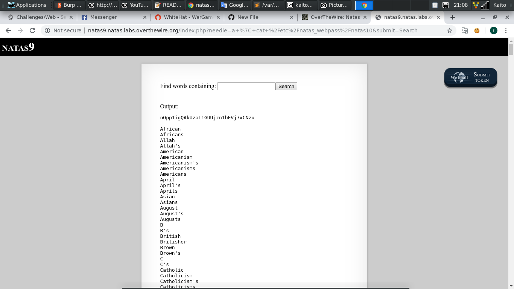

# Natas9

- Thử `viewsource` xem có gì

- Thực sự thì đây là bài `command injection` cơ bản

- Đọc thêm về `command injection` : [Link](https://viblo.asia/p/os-command-injection-la-gi-command-injection-co-nguy-hiem-khong-can-cuc-ky-than-trong-doi-voi-cac-lenh-os-goi-tu-website-cua-ban-OeVKB3PEZkW)

- Payload: `a | cat /etc/natas_webpass/natas10`

